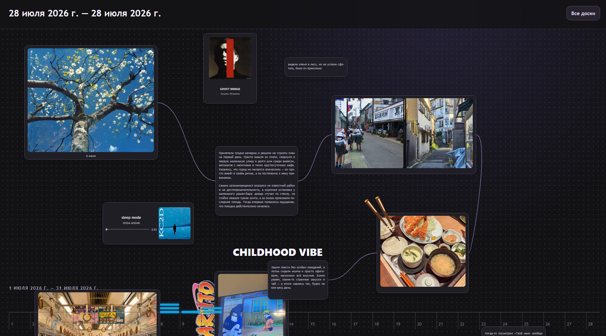
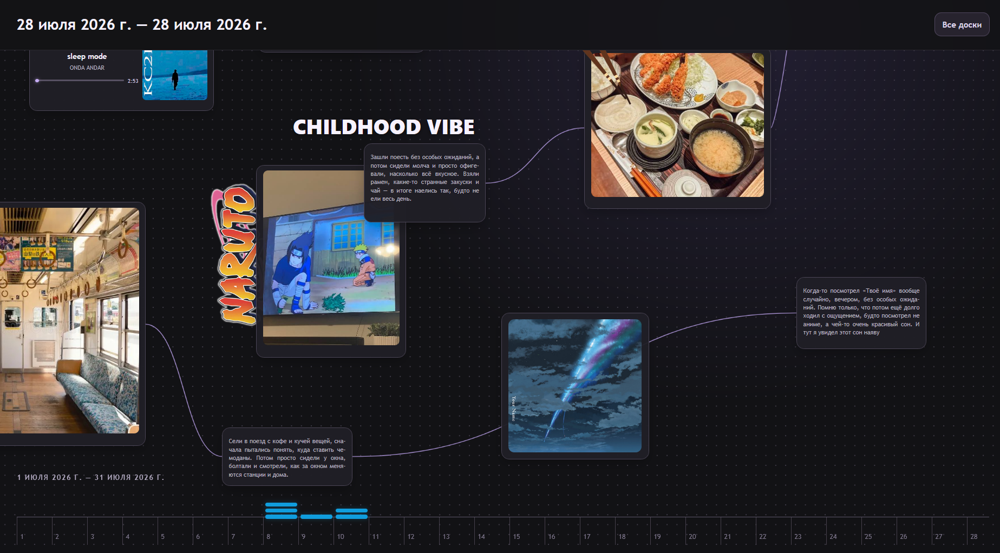
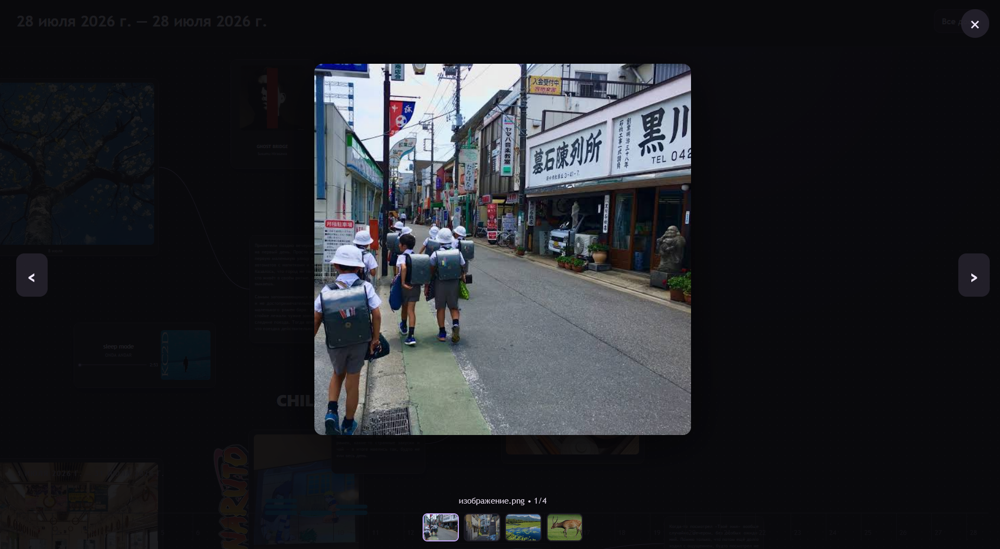
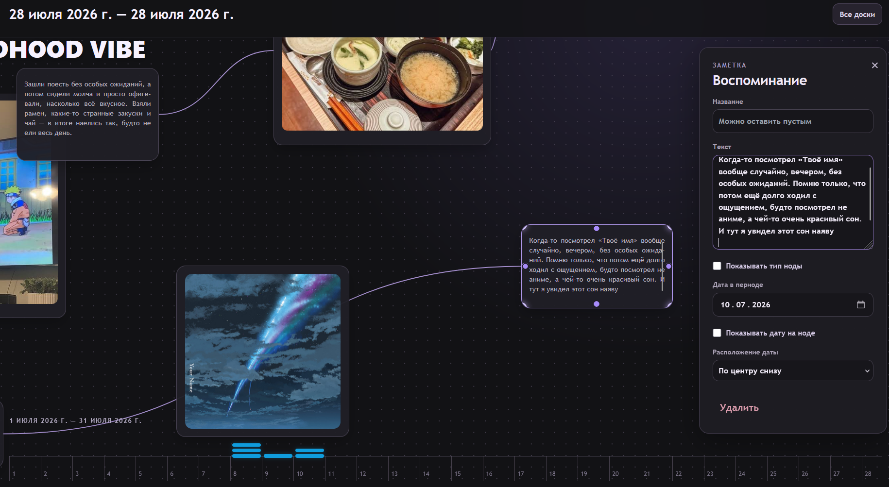

# MemoryBox

[Русская версия](README.md)

MemoryBox is a local application for creating visual boards about lived periods: a week, month, trip, school term, or any other stretch of life.

On an infinite canvas, you can freely arrange notes, photos, videos, and music, add dates, and connect related memories. The result is neither a publication feed nor a rigid diary, but a personal map of a period—its important events, small details, people, places, and soundtrack.

## The idea

An ordinary photo gallery stores files well, but it rarely preserves their context. Years later, a photo may remain while the reason it mattered is lost.

MemoryBox lets you keep together everything that makes up a memory:

- a photo from a summer evening;
- a brief note about a conversation on the way home;
- a song that was always playing then;
- several shots from one event;
- a caption, joke, or decorative image;
- a connection to another day, person, or story.

You decide which events belong next to each other, which memories are prominent, what should be connected, and how much empty space remains between objects. The canvas does not impose a single correct order; it helps you recreate the logic of your own memory.

## What you can create

### Period boards

Each board is dedicated to a chosen time span. It can cover one day, several weeks, a month, or an entire trip. You define its title and dates.

### Notes

Cards with a title, text, and an optional date. They work equally well for a detailed story of an event or a single phrase worth remembering.

### Media cards

Add multiple photos and videos to one card. Choose important shots for the preview, then open all media in a separate viewer.

### Music and playlists

Place an individual track or a small playlist on the canvas. Music becomes part of a memory alongside text and photos. Tracks can be filled in manually or, when available, found through Spotify.

### Free text and images

Not every object has to be a card. Put a large caption, quote, section heading, or transparent PNG image on the canvas—for example, a sticker, a symbol of a place, or a visual accent.

### Connections between memories

Cards and objects can be joined by lines. A connection can represent a continuation of one story, a shared day, person, place, or mood—you decide what it means.

### Timeline

The timeline at the bottom of a board shows which dates contain more memories and helps you navigate the period. Object placement remains free: a date never dictates a card's position on the canvas.

## What a board can look like

A board has no required template. For example, start a month with a large photo and heading, collect notes, music, and photos from the first busy day around it, then give a separate walk its own branch. Quiet days can remain small cards while an important event occupies a noticeable part of the canvas.

MemoryBox does not try to explain a person's past automatically. It provides the material and space in which you can see these connections for yourself.

## Personal and local

MemoryBox is designed as a local single-user application. Boards, text, and metadata are stored in a local database, while uploaded photos, videos, and covers are stored separately in local storage.

It is not a social network: there are no followers, likes, public profiles, or pressure to turn a memory into a post. A board is created first and foremost for its owner.

---

## Screenshots









## Quick start

You will need Docker:

```bash
docker compose up --build
```

After the build, MemoryBox will be available at [http://localhost:5173](http://localhost:5173).

Spotify music search is optional. Without it, tracks and playlists, including their covers, can still be added manually.
